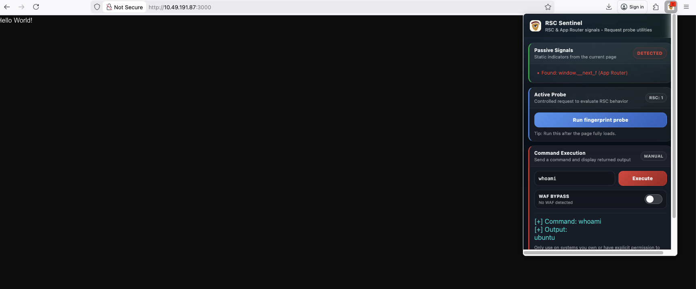

# RSC Sentinel

A Firefox extension for detecting React2Shell vulnerabilities (CVE-2025-55182 & CVE-2025-66478) in web applications.

## 👁️ Overview
RSC Sentinel is a Firefox browser extension for security researchers and educators who want to observe React Server Components (RSC) and Next.js App Router indicators while browsing. It focuses on passive detection by default, highlighting potential signals without altering site behavior. For authorized assessments, it also offers optional manual tools for active probing and controlled command execution initiated by the user.

## 🧩 Features
- **Passive Detection**: Automatically watches for high-level RSC and App Router indicators during normal browsing.
- **Active Probing**: Allows a user-initiated fingerprint request to gather additional signals in a controlled manner.
- **Manual Command Execution**: Provides a manual, user-driven execution workflow intended strictly for authorized testing.

## 🧠 How Detection Works (High-Level)
RSC Sentinel evaluates a combination of runtime indicators, HTTP response headers, and response content patterns that are commonly associated with RSC and App Router behavior. Results are presented as signals and should be interpreted as indicators rather than definitive proof of vulnerability.

## 🦊 Installation (Firefox)
Install the extension from source using Firefox’s temporary add-on workflow:

1. Open Firefox and navigate to `about:debugging`.
2. Select **This Firefox** in the left sidebar.
3. Click **Load Temporary Add-on**.
4. Choose the `manifest.json` file from the project directory.

The extension will load immediately for the current browser session.

## ▶️ Usage
- Browse normally; the extension performs passive detection in the background.
- Open the extension popup from the Firefox toolbar to view detected signals.
- Use **Run fingerprint probe** to initiate a manual probe when authorized.
- Review results in the popup UI, where passive and active signals are displayed clearly.



## 🗂️ Project Structure
Example layout for the extension source:

```
.
├── manifest.json
├── background.js
├── content.js
├── popup.html
├── popup.js
├── images/
│   └── img2.png
│   └── img1.png
└── rules.json
```

## ⚠️ Responsible Use / Warning
This extension must only be used on systems you own or where you have explicit permission to test. Misuse of security tooling may be illegal or unethical. Use RSC Sentinel responsibly and in accordance with all applicable laws and policies.

## 📜 License & Disclaimer
This project is open-source and provided for educational and authorized security research purposes. The author is not responsible for misuse. Always conduct testing legally, ethically, and with explicit permission.
